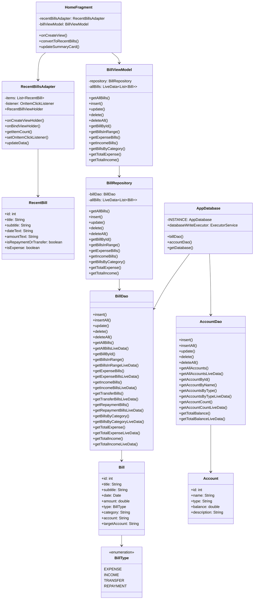

# Home界面相关类图

下面是使用Mermaid语法描述的Home界面相关类图：

## 类图说明

1. **UI层**：
   - `HomeFragment`：Home界面的主要Fragment，负责展示账单列表和统计信息
   - `RecentBillsAdapter`：账单列表适配器
   - `RecentBill`：UI展示用的账单数据模型

2. **ViewModel层**：
   - `BillViewModel`：连接UI和数据仓库的桥梁

3. **Repository层**：
   - `BillRepository`：封装数据访问逻辑

4. **数据访问层**：
   - `BillDao`：账单数据访问接口
   - `AccountDao`：账户数据访问接口

5. **实体类**：
   - `Bill`：账单实体
   - `BillType`：账单类型枚举
   - `Account`：账户实体

6. **数据库**：
   - `AppDatabase`：Room数据库主类

这些类共同构成了Home界面的数据展示和管理系统，遵循了Android架构组件的最佳实践。